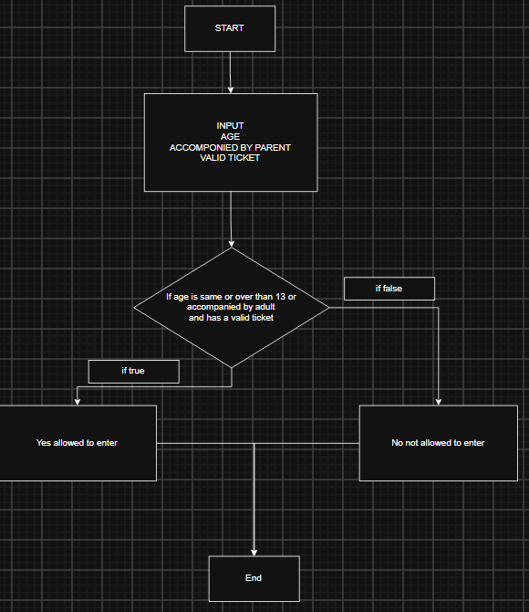

###**1.1 What are input?**
**Users age, accompanied by an adult, valid ticket**

###**1.2 What is the process**
**If age is same or over than 13 or accompanied by adult and has ticket**

###**1.3 What is the output**
**Person is allowed/not allowed to enter**

###**2.1 Create the diagram using draw.io/ canva.etc**

###2.2 Complete truth table
| age >= 13 | Accompanied by adult| hasticket | Result      |
|-----------|---------------------|------------|-------------|
| True      | True                | True       | Allowed     |
| True      | True                | False      | Not Allowed |
| True      | False               | True       | Allowed     |
| True      | False               | False      | Not Allowed |
| False     | True                | True       | Allowed     |
| False     | True                | False      | Not Allowed |
| False     | False               | True       | Not Allowed |
| False     | False               | False      | Not Allowed |

###**2.3 Design an algorithm**

1. START
2. INPUT age
3. INPUT acccompanied by adult
4. INPUT has ticket
5. IF condition is true allow to enter
6. ELSE now allowed to enter
7. STOP

###**2.4 Create Pseusocode**
**age = int(input("Enter age: "))
accompanied = input("Accompanied by adult? (yes/no): ")
has_ticket = input("Has valid ticket? (yes/no): ")
if (age >= 13 or accompanied) and has_ticket:
    print("Allowed to enter")
else:
    print("Not allowed to enter")**

###**3.1 Test with some input samples**

| age | accompanied | ticket | Expected    |
|-----|-------------|--------|-------------|
| 10  | Yes         | Yes    | Allowed     |
| 10  | No          | Yes    | Not Allowed |

